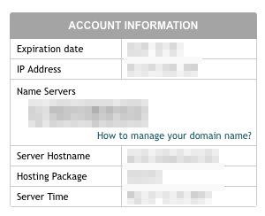

# How to deploy from GitHub to SiteGround using Travis, Rsync and SSH

You can use [Travis CI](https://travis-ci.com/) to deploy to [SiteGround](https://www.siteground.com/) - or most Cpanel webhosts that let you use SSH.

The setup of your own SiteGround account (or other Cpanel host) may be slightly different, but this should plug the main gaps.

The script assumes you want to deploy everything in the `./build` directory to the root of site.

There's also a dummy `tests.sh` script included, otherwise Travis won't deploy if the tests don't complete. This script can be removed once you implement your own testing.

## Notes on Create React App

If you're using [Create React App](https://create-react-app.dev/), make sure you remove `/build` from the `.gitignore` it creates so that directory is available for Travis to deploy.

## Add SSH key to SiteGround

The first stage is to generate a key pair to allow you to connect to your account via SSH.

```bash
ssh-keygen -t rsa -b 4096 -C 'build@travis-ci.org' -f ~/.ssh/siteground_rsa
```

When it asks for a password, leave it blank (Travis won't be able to enter the password when prompted).

This will create a `siteground_rsa` private key and a `siteground_rsa.pub` public key in your `~/.ssh/` directory.

In Cpanel, find `SSH/Shell Access` in the `Advanced` section:


Copy the *public* key to your clipboard using:

```bash
pbcopy < ~/.ssh/siteground_rsa.pub
```

Paste it into the `Public Key` box in the `Upload SSH key` section:


Leave `Allowed IP address` blank if you want to allow access from any IP address (less secure).

Travis lists its [IP Addresses](https://docs.travis-ci.com/user/ip-addresses/), which you can add manually to make it more secure.

## Add Travis config

The deploy.sh script expects four variables:

`SG_PORT` - the port SiteGround uses for SSH, 18765  
`SG_USER` - the username used to login to SiteGround  
`SG_DOMAIN` - the domain for the SiteGround account (probably in the format hostname.siteground.biz)  
`SG_KEY` - the public key for the SiteGround domain  

`SG_PORT` isn't sensitive, so can be declared as a normal global environment variable in `.travis.yml`.

The remaining three are sensitive so are best encrypted rather than left in plain text.

To find your `SG_DOMAIN`, login to Cpanel and it's listed after `Server Hostname` in the Account Information section:  


To find your `SG_KEY`, SSH into your SiteGround account on your local machine using a valid SSH key with the following command:

```bash
ssh [SG_USER]@[SG_DOMAIN] -p [SG_PORT]
```

If successful, this will write an entry for your `SG_DOMAIN` to your `~/.ssh/known_hosts`.

Find the entry in your `~/.ssh/known_hosts` file and copy just the last long string. It will be in the format:
```
[SG_DOMAIN]:18765,[IP_ADDRESS]:18765 ecdsa-sha2-nistp256 [SG_KEY]
```

## Encrypt Travis secrets

Travis creates a key pair for each registered repository. To use the encryption install the Travis CLI tool:

```bash
gem install travis
```

Login to Travis in the project directory, using the `--pro` option:

```bash
travis login --pro
```

Encrypt the secrets using the following commands and then add the values to your `.travis.yml` file:

```bash
travis encrypt --pro SG_USER=username
travis encrypt --pro SG_DOMAIN=hostname.siteground.biz
travis encrypt --pro SG_KEY=key
```

## Encrypt SiteGround private key

*Before* you add the SiteGround private key to your repository you must encrypt it, otherwise anyone could download it and use it to login to your account.

```bash
cd deploy
travis encrypt-file --pro ~/.ssh/siteground_rsa
```

This will output something similar to:

```bash
openssl aes-256-cbc -K $encrypted_XXX_key -iv $encrypted_XXX_iv -in siteground_rsa.enc -out ~\/.ssh/siteground_rsa -d
```

Change this line to:

```bash
openssl aes-256-cbc -K $encrypted_XXX_key -iv $encrypted_XXX_iv -in ./deploy/siteground_rsa.enc -out /tmp/siteground_rsa -d
```

And add it to the `before_deploy` section of your `.travis.yml`.

## Deploy to Staging or Production

The script allows for deployment to Staging or Production, so you need to specify these directories in `deploy.sh`

```bash
if [[ "$1" = "production" ]] ; then
  DEPLOY_DIR="[production_directory]"
else
  DEPLOY_DIR="[staging_directory]"
fi
```

Change the directory location to match your SiteGround directory setup.

The `'travis.yml'` will deploy to staging if the branch is staging, or to production if the branch is main.

## Example `deploy.sh` and `.travis.yml`

### `deploy.sh`

```bash
#!/bin/sh

if [[ "$1" = "production" ]] ; then
  DEPLOY_DIR="[production_directory]"
else
  DEPLOY_DIR="[staging_directory]"
fi

echo "Deploying files to server"
echo "[${SG_DOMAIN}]:${SG_PORT} ecdsa-sha2-nistp256 ${SG_KEY}" >> ${HOME}/.ssh/known_hosts
# ssh ${SG_USER}@${SG_DOMAIN} -p ${SG_PORT}
rsync -avP -e "ssh -p ${SG_PORT}" build/ ${SG_USER}@${SG_DOMAIN}:/home/${SG_USER}/domains/${DEPLOY_DIR}/
echo "Deployment complete"
```

To test the connection without deploying, comment out the rsync line and uncomment the ssh line.

### `.travis.yml`

```yml
language: node_js
node_js:
- stable
cache:
  directories:
env:
  global:
  - SG_PORT=18765
  - secure: "[long_string]"
  - secure: "[long_string]"
  - secure: "[long_string]"
script: "./deploy/tests.sh"
before_deploy:
  - openssl aes-256-cbc -K $encrypted_XXX_key -iv $encrypted_XXX_key -in ./deploy/siteground_rsa.enc -out /tmp/siteground_rsa -d
  - eval "$(ssh-agent -s)"
  - chmod 600 /tmp/siteground_rsa
  - ssh-add /tmp/siteground_rsa
  - rm /tmp/siteground_rsa
deploy:
  - provider: script
    skip_cleanup: true
    script: bash ./deploy/.deploy.sh staging
    on:
      branch: staging
  - provider: script
    skip_cleanup: true
    script: bash ./deploy/.deploy.sh production
    on:
      branch: main
```
