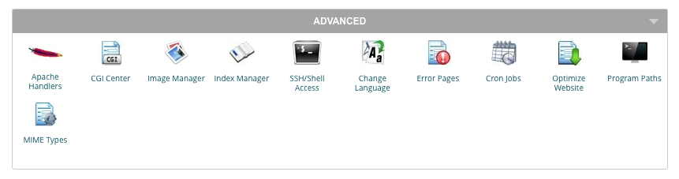
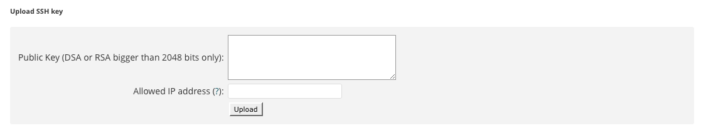

# How to deploy from GitHub to SiteGround using Travis

You can use [Travis CI](https://travis-ci.com/) to deploy to [SiteGround](https://www.siteground.com/) - or most Cpanel webhosts that let you use SSH.

## Add SSH key to SiteGround

The first stage is to generate a key pair to allow you to connect to your account via SSH.

```bash
ssh-keygen -t rsa -b 4096 -C 'build@travis-ci.org' -f ~/.ssh/siteground_rsa
```

When it asks for a password, leave it blank (Travis won't be able to enter the password when prompted).

This will create a `siteground_rsa` private key and a `siteground_rsa.pub` public key in your `~/.ssh/` directory.

In Cpanel, find `SSH/Shell Access` in the `Advanced` section:



Copy the *public* key to your clipboard using:

```bash
pbcopy < ~/.ssh/siteground_rsa.pub
```

Paste it into the `Public Key` box in the `Upload SSH key` section:



Leave `Allowed IP address` blank if you want to allow access from any IP address (less secure).

Travis lists its [IP Addresses](https://docs.travis-ci.com/user/ip-addresses/), which you can add manually to make it more secure.

## Add Travis config

The deploy.sh script expects four variables:

`SG_PORT` - the port SiteGround uses for SSH  
`SG_USER` - the username used to login to SiteGround  
`SG_DOMAIN` - the domain for the SiteGround account  
`SG_KEY` - the public key for the SiteGround domain  

`SG_PORT` isn't sensitive, so can be declared as a normal global environment variable in `.travis.yml`.

The remaining three are sensitive so are best encrytped rather than left in plain text.

## To do

- Add encrypting Travis secrets  
- Add encrypting private SiteGround key  
- Add staging branch  
